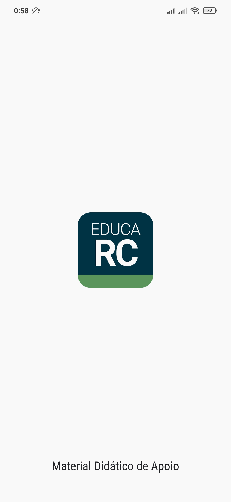
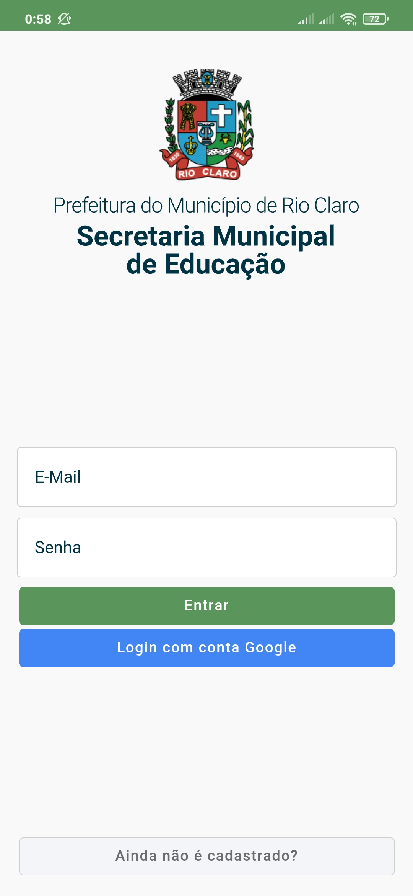
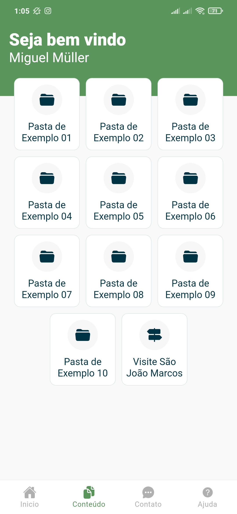
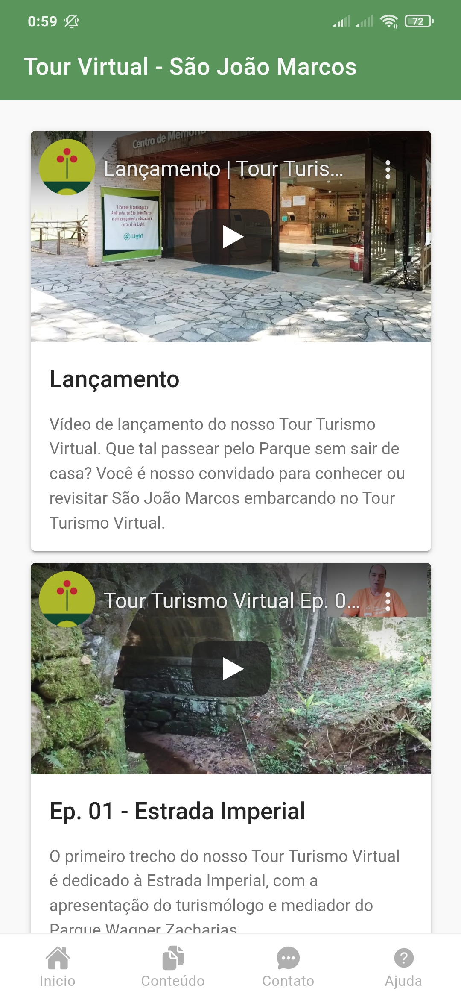

# **Educational Sharing Activities- COVID-19**


## **Overview**
Platform for sharing educational activities (pdfs) for students in the [**Municipal Education Network of Rio Claro / Rio de Janeiro**](https://rioclaro.rj.gov.br/) during the period of social isolation caused by the pandemic of COVID-19 in the year 2020. The Project was developed with **[Angular](https://angular.io/)** + **[Ionic](https://ionicframework.com/)** + **[Firebase](https://firebase.com/)**.

The project was in production during the period of the year 2020.

- Feat 01
- Feat 02
- Feat 03

|[See Demonstration](https://educational-sharing-pwa.web.app) |
|:---------------------------------------------------:|

[**`Angular`**](https://angular.io/) is a platform and framework for building the application interface using HTML, CSS and, mainly, JavaScript, created by Google's developers. It has some basic elements that make this construction interesting. Among the main ones, we can highlight the components, templates, directives, routing, modules, services, dependency injection and infrastructure tools that automate tasks, such as executing the unit tests of an application.  

[**`Ionic`**](https://ionicframework.com/) is a free Open Source Framework under the MIT license for the development of hybrid mobile applications. Hybrid applications are mobile applications built in an alternative way to native applications. They are built, generally, using HTML + CSS + JavaScript, in this way they have become extremely popular, as it allows multiplatform development, using the same HTML for different operating systems. 

[**`Firebase`**](https://console.firebase.google.com/) is a toolset platform developed by Google that helps build, improve, and grow your app. The tools it offers cover a large part of the services that developers would normally have to build on their own. This includes things like analysis, authentication, databases, configuration, file storage, push messages and the list goes on. The services are hosted in the cloud and have great scheduling flexibility. The following services offered by Firebase were used in this project: **Authentication**, **Database with Cloud Firestore**, **Storage**, **Hosting**, **Cloud Messaging**

<br>

## **Project Requirements**  
Make sure that you also have **[NodeJS](https://nodejs.org/)** and **[NPM](https://www.npmjs.com/)** installed on your computer.
- `$ node --version` and `$ npm --version`

<br/>

**Install dependencies** of project with:  
- `$ npm install`

<br/>

**Angular Cli** is already part of the development dependencies, so any cli functionality can be used with the prefix npx.

- `$ npx ng serve`

<br/>

**First Execution - Environment files**: In the first execution of the project, it is **essential** to create the environment files (_environment.ts_) in _/src/environments_ according to the model that follows inside the folder (_environment.exp.ts_).

<br/>

### **Mmessaging Configuration**  
Firebase Messaging configuration **`./src/firebase-messaging-sw.js`**

```shell
importScripts('https://www.gstatic.com/firebasejs/7.8.1/firebase-app.js');
importScripts('https://www.gstatic.com/firebasejs/7.8.1/firebase-messaging.js');

firebase.initializeApp({
  apiKey: '',
  projectId: '',
  messagingSenderId: '',
  appId: '',
});

const messaging = firebase.messaging();
```

<br>

## **Running Locally**  
Run te command  
**`$ ionic serve --lab --external`**
- The **`--lab`** flag allows multiplatform viewing in the browser
- The **`--external`** flag is for the application to be available for access within the internal network 

<br>

## **Screenshot**
|  |     |
|-----------------------------------------------|-----------------------------------------------|
|        |  |


<br>

## **Workflow**  
**[WORKFLOW.md](WORKFLOW.md)** - This project uses the workflow pattern called `git flow`.
- [Atlassian - Comparing Workflows](https://www.atlassian.com/br/git/tutorials/comparing-workflows/gitflow-workflow)
- [Difference between workflows](https://www.zup.com.br/blog/git-workflow)
- [Girflow Cheatsheet](https://danielkummer.github.io/git-flow-cheatsheet/index.pt_BR.html)

<br/>

## **Tests**  
[Need to be implemented]

<br/>

## **Deploy**  
**[GITHUB ACTIONS](https://github.com/miguelsmuller/pwa-educational-sharing/actions)** - To deploy to a demonstration of project hosted in Firebase Hosting.

<br/>

## **Contributing**  
**[CONTRIBUTING.md](CONTRIBUTING.md)** - Specifications of how the contribution should be submitted

<br/>

## **Changelog**  
**[CHANGELOG.md](CHANGELOG.md)** - Chronologically list of changes for each version of a project

